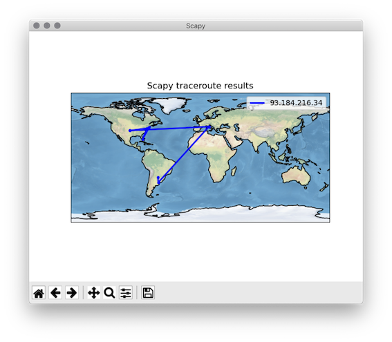

## Intro
This project use [scapy](https://scapy.net/) to do the traceroute and [ipgeolocation.ip](https://ipgeolocation.io/) to geolocate the ips.
The command will store the traceroutes in a file and in a sqlite database. 

## Before Start
Install miniconda [link](https://docs.conda.io/en/latest/miniconda.html)

Download the geolite2 database [link](https://www.maxmind.com/en/geolite2/signup)

Create an account in [ipgeolocation.ip](https://ipgeolocation.io/), copy the apiKey and replace it in the file .env
 
## Setup Environment
```bash
$ conda create -n traces python=3.6
$ conda activate traces
$ conda install scapy cartopy
$ pip install geoip2 dataclasses
```
## Activate virtual env
```bash
$ conda activate traces
```

## Create the database
This command will create test.db case exist will overwrite it.

```bash
$ python database.py
```
## Run a trace

The following command will create a file like this
*42bc99cb-8387-4918-ab49-5ab574a2b7ab*

```bash
$ sudo python tracer.py www.example.com
```
The traceroute hops will be store in the traces.sqlite database the id of the trace is the same as the file above.

## Show Trace Map
create map takes two params 

first is the geomaplite.mmdb pathfile
sencod is the file created by tracer.py

```bash
$ python trace_map.py /path/to/geolite2.mmdb 42bc99cb-8387-4918-ab49-5ab574a2b7ab
```


## Database table

The tracer will create a table named TRACE the table looks like this

|ID|HOP|IP|COUNTRY|CITY|ISP| LATITUDE| LONGITUDE|DATE_CREATED|
|---|---|---|---|---|---|---|---|---|
|d3aa1809-b729-4eab-8392-ffcf3a400510|	1	|19.19.19.19	|Argentina	|Barranqueras	|an_isp	|12.12	|11.11	|2020-12-04 19:26:15.220-030|

